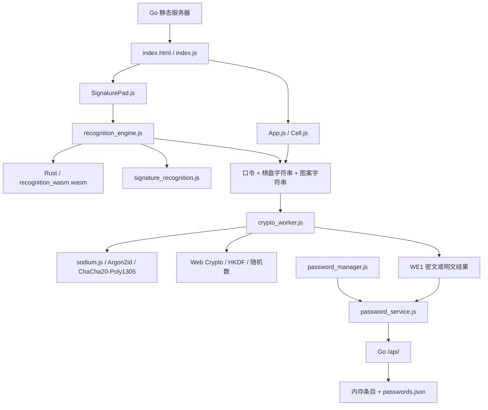

# WebEncryptor 项目资料、架构与实现细节

整理日期：2026-09-29。本文为修改前快照；当前 WE2、重画验证、棋盘与保存行为见 [交互与可靠保存变更](USABILITY_CHANGES.md)。基于当前工作区源码与现有文档；阅读起点提交为 `80e7ca7`。本文记录现状，不修改业务代码。历史审查报告的数字与发布物描述不能直接当作当前事实。

## 1. 项目用途和技术组成

WebEncryptor 是浏览器文本加解密工具，附带服务器端条目管理。用户提供主口令、彩色棋盘编码、手绘方向序列，浏览器派生密钥并执行加解密。条目管理保存名称、描述和 `password` 字符串；正常加密保存流程将 WE1 密文写入该字段，但 API 本身不强制存密文。

| 层次 | 技术与职责 |
| --- | --- |
| 页面 | HTML/CSS、原生 DOM、ES modules；棋盘单独使用 React 19.1.0 |
| 加密 | Web Worker、随仓库分发的 sodium.js、Web Crypto HKDF 与随机数 |
| 图案识别 | JS 参考实现、Rust/WASM 加速实现、JS 聚合与缓存 |
| 服务端 | Go 标准库，静态文件嵌入、HTTPS、JSON CRUD、关机接口 |
| 持久化 | 内存数组 + 整文件 passwords.json，单进程互斥锁 |
| 构建 | Bash + Go 交叉编译；Cargo 编译 wasm32-unknown-unknown |
| 测试 | Node 合成笔迹回归、JS/WASM parity、画板状态回放、加密冒烟；Rust 单元测试 |

仓库没有前端 package.json、JSX/TypeScript 编译链、数据库驱动、容器配置或现成 CI 配置。`go.mod` 指定 Go 1.27，无第三方 Go 依赖；Rust crate 无第三方依赖，edition 2021。

## 2. 文件地图

| 文件/目录 | 内容 |
| --- | --- |
| README.md | 中英文使用、构建、加密格式和识别说明；部分表述与代码不同 |
| docs/REVIEW.md | 历史算法、性能、流程审查及已实施修改 |
| docs/SECURITY_REVIEW.md | 历史服务器暴露风险审查；含当时 dist 发布物情况 |
| server.go | 全部 Go 服务逻辑，582 行 |
| build.sh | 7 个平台组合 + Windows amd64 静默版 |
| build-wasm.sh | 编译 Rust 并复制 WASM 到 htdocs |
| htdocs/index.html | 页面结构、import map、密码卡片模板、两个模块入口 |
| htdocs/index.css | 页面、模态框、卡片、画板样式；600px 响应式断点 |
| htdocs/index.js | DOM 控制、加解密调度、页签、结果显示、剪贴板、随机密码、关机 |
| htdocs/App.js | React 6×6 棋盘、真实/展示状态、鼠标触摸、编码与撤销 |
| htdocs/Cell.js | 单格渲染与鼠标/触摸事件 |
| htdocs/constants.js、sortUtils.js | 棋盘常量和格子坐标排序 |
| htdocs/SignaturePad.js | Canvas 画板、多笔状态、离屏缓存、确认、撤销、隐藏反馈 |
| htdocs/signature_recognition.js | JS 识别算法规格、默认参数、聚合与增量接口 |
| htdocs/recognition_engine.js | WASM 加载、内存和 ABI、JS 回退、输入防御 |
| htdocs/recognition_wasm.wasm | 已提交的识别二进制，约 48 KiB 磁盘占用 |
| rust/recognition/src/lib.rs | JS 单笔识别的 Rust 镜像，853 行 |
| htdocs/crypto_worker.js | 加密、解密、verify、密文解析和消息协议 |
| htdocs/sodium.js | 压缩第三方密码库，约 1.1 MiB；浏览器运行所需实现随文件提供 |
| htdocs/password_service.js | fetch API 单例、localStorage token、401 重试 |
| htdocs/password_manager.js | 卡片 CRUD、懒加载列表、两种解密入口 |
| htdocs/vendor/ | React、React DOM、client、scheduler 的本地 ESM 发行文件 |
| htdocs/manifest.json、图标 | standalone 展示元数据与图标 |
| htdocs/pad-tester.html | 手工绘制测试页面 |
| test/ | 识别、电池数据生成、画板回放和加密冒烟测试 |

第三方压缩发行文件按来源标记、模块依赖和调用边界检查；PNG/WASM 按资源与运行用途检查。当前 `.agents/`、`.codex/` 中未发现可读取的项目指令文件。

## 3. 系统结构与数据边界



正常流程中，主口令、棋盘和图案因子仅传给浏览器 Worker；Go 不参与密钥派生或解密。保存密文才调用 API。服务器会看到名称、描述、密文，也能分发或替换客户端代码，因此“浏览器加密”仍依赖页面和脚本来源可信。

静态资源全部自托管，不依赖 CDN。manifest 没有配套 Service Worker；离线指本地服务器可在无互联网时运行，不能据此认定网页关闭服务器后仍可离线启动。

## 4. 页面初始化与操作流程

1. HTML import map 将 React 等裸模块名映射到 vendor 文件。
2. `index.js` 读取 DOM、创建画板、注册按钮和页签、挂载棋盘，最后创建经典 Worker。
3. 识别引擎导入时异步加载 WASM，未完成时使用 JS；Worker 同步 importScripts sodium.js，再等待 sodium.ready。
4. 页面顶部三个因子始终可见，下方 Data Panel 与 Manager 切换；Data Panel 内加密和解密输入互斥显示，文本保留。
5. 加解密取输入、图案、棋盘字符串，经 postMessage 发给 Worker；Worker 返回两步进度、成功结果或错误。
6. Data Panel 解密显示内联明文；Manager 普通卡片解密弹出结果窗口；编辑卡片的解密按钮仅跳转并填入密文。
7. Manager 列表首次进入时加载，每次切回时刷新；加密结果可直接保存为新条目。

主要跨模块桥接是 `window.reactAppRef.current`、`switchCryptoMode`、`switchToTab`、`scrollToSection`、`triggerDecrypt`、`refreshPasswordList`。这构成当前 UI 的实际接口边界，页面并非完整 React 应用。

随机密码生成提供 8/14/18 字符选项，使用 crypto.getRandomValues，字符集为大小写字母、数字及 `^*_+-=.<>`；生成内容填入待加密明文，而非主口令。

## 5. 棋盘因子的实际编码

棋盘列 A–F、行 0–5，共 36 格。点击颜色循环为默认 → RED → GREEN → BLUE → BLACK → 默认；拖动以起点当前颜色涂格，从空格不能拖动涂色。

真实状态 `cells` 保存格子的最终颜色和 `lastSetTimestamp`；`displayCells` 是展示状态。`getFullData()` 取已着色且有时间戳的格子，按最近设置时间升序，将 `颜色+坐标` 无分隔拼接，例如 `REDA0GREENB1BLUEC2`。

这不是完整事件日志：重复点同格只留下最终颜色和最近时间；清空格子后该格不进入编码。毫秒时间戳相同的格子会依赖收集顺序和稳定排序，不能表示同毫秒内的精确先后。`getHalfData()` 将上下半区按列、行排序，当前加解密使用 full。

加解密提交后 `shuffleCellColors()` 只替换展示颜色，实际密钥因子保持在 cells 中。随机展示使用 Math.random，只选 RED/GREEN/BLUE。后续真实状态变化又会同步展示状态。

棋盘撤销的意图是清空最近设置的格子，并不恢复前一个颜色；当前 `handleUndo` 的 useCallback 依赖为 `[]`，读取闭包中的初始 cells，存在陈旧状态问题。此点为静态发现，尚未做浏览器交互复现。

## 6. 手绘识别与状态管理

识别输出方向字母表为 R、RU、U、LU、L、LD、D、RD。方向由主方向位移分类，短/长轴比例 ≤0.5 时取水平或垂直，否则取对角；不是八个等宽角度桶。Canvas 的 y 正方向向下。

| 阶段 | 具体实现 |
| --- | --- |
| 抖动估计 | 点二阶差分模长的一半，25% 分位除以 0.925；确定性 quickselect，平均 O(n) |
| 去噪 | 迭代 Douglas–Peucker；容差 min(max(8, σ×5), 12.8) px |
| 重采样 | 等弧长 2px，保留起终点；选项步长限制为 0.5–8px |
| 拐角检测 | 前后各约 10px 的双弦夹角、5 点滑窗；局部峰至少 24°，20px 内合并 |
| 分段 | 段内点协方差的最小二乘主方向；长度用路径弧长 |
| 修剪 | bridge → between → spike → collinear → short，每轮删除后重并同方向段 |
| 聚合 | 各笔独立处理后按笔画顺序拼接，不将抬笔跳跃当作线段 |

短段门槛为弧长 18px 或弦长 2px；共线拟合转角门槛 14°。between/spike 长度帽实际使用 `max(26, 0.65×较短邻段弧长)`，不能将注释中的“absolute cap”理解成严格 26px 上限。between 还要求一侧转角 ≥40°；spike 要求邻段短扇区 ≤135° 且中段方向在扇区之外。

参考模块默认图案有效段数为 10–64。**画板组件默认 minSegments=1，主页面未覆盖该参数，所以主页面实际是 1–64；手工 pad-tester 显式设置为 10。** 当前实现用固定 CSS px 阈值，没有按画板宽度归一化；平移不敏感，缩放仅在一定范围和足够长的线段下稳定。

单笔输出 `{sequence, segments:[{dir,length}], count, empty}`；图案输出另含 valid、invalidReason、message，无效时 sequence=null。长度只用于识别及反馈，不进入加密因子。

方向直接拼接，没有分隔符，`R`+`U` 与单个 `RU` 都编码成字符串 `RU`。段数、笔画边界也不进入 KDF；不同分段方式可映射到相同因子字符串，不能把方向段数直接等同于独立熵。

SignaturePad 使用 Pointer Events 和指针捕获，忽略移动不足 1px 的采样；rAF 合并识别更新，已提交笔画缓存识别结果和离屏画布。撤销/清空/提交异常时从 strokes 重建识别缓存。

Confirm 会隐藏墨迹并清空 strokes，但保留识别缓存及 lastResult 供加密使用，禁止继续绘制和撤销，Clear 才重置。它属于单独的已确认状态，不能套用“strokes 始终是唯一真相”的注释。5 秒隐藏只遮蔽反馈，未确认墨迹仍在画布中；眼睛按钮可持续显示方向。

## 7. WASM 内核和接口

Rust crate 输出 cdylib/rlib，无 wasm-bindgen。ABI 导出 alloc、dealloc、classify_dir_f、extract_stroke；输入是线性内存中的 f64 `[x0,y0,x1,y1,…]`，每点 16 字节。

返回 24 字节 repr(C) 结构体：seq_ptr、seq_len、count、valid、empty、padding、seg_ptr、seg_bytes。段数组每项 8 字节：方向码 u32 + 四舍五入弧长 u32。JS 以小端读取并校验指针与长度边界。

JS 输入缓存仅扩容，容量至少 64 点；每次调用重新创建内存视图，避免 WASM memory 增长导致旧 ArrayBuffer 失效。Rust 的 LAST_RESULT 保存返回结构和输出缓冲，下一次提取释放上一次结果，因此 JS 需立即复制读取。

浏览器优先 instantiateStreaming，缺少该 API 时用 arrayBuffer；加载异常切到 JS，存在 streaming API 但 streaming 失败时不会再尝试普通 WASM instantiate。Node 测试从文件系统加载。

引擎拦截缺点、NaN、Infinity，异常时尝试 JS 回退；部分 ABI 异常直接变 EMPTY。共享输入缓存减少分配，但 Rust 算法仍创建 Vec，JS 仍复制坐标并构建输出对象，不能理解为整个管线零拷贝或零分配。

## 8. 密钥派生、密文和消息协议

设 A=主口令、B=棋盘字符串、C=图案字符串、S=16 字节随机盐：

```text
material = u32be(len(UTF8(C))) || UTF8(C)
         || u32be(len(UTF8(B))) || UTF8(B) || S
argonSalt = BLAKE2b-128(material)
masterKey = Argon2id(UTF8(A), argonSalt, 3 passes, 256 MiB, 32 bytes)
encKey = HKDF-SHA256(masterKey, salt=S, info="WebEncryptor:enc:v1", 32 bytes)
nonce = random(12 bytes)
(ciphertext, tag) = ChaCha20-Poly1305-IETF(UTF8(plaintext),
                   AAD="WebEncryptor:v1", nonce, encKey)
WE1.<base64(S)>.<base64(nonce)>.<base64(ciphertext)>.<base64(tag)>
```

MAC 为 16 字节，密钥为 32 字节。随机盐、nonce 和 tag 随密文保存；密文不保存识别参数或 KDF 参数，修改默认算法需考虑现有密文重现与格式版本兼容。旧多层密文被明确拒绝。

Worker 接收 encrypt/decrypt/verify；verify 当前等同解密，返回明文。成功消息 `{status:'success',action,result}`，失败消息 `{status:'error',action,error}`；progress 有 currentStep、totalSteps、stepName。没有请求 ID 或任务队列，Manager 解密入口也没有完整的进行中互斥。

pattern 和 path 会 trim，password 不 trim。上限按 JS 字符串 length 检查：口令 4096、图案 2048、棋盘 65536、明文 4×1024²、密文 6×1024²。这不是 UTF-8 字节上限；大量多字节字符可导致本工具生成的密文超过其解密字符上限。参数没有完整 typeof 校验，图案也未校验为方向字母表。

代码对部分临时盐和密钥执行 fill(0)，但 AEAD 抛异常等路径不保证清理，明文和 JS 字符串也不被可靠清除；应记录为尽力零化。两步进度只表示开始派生和开始 AEAD，不是 Argon2id 内部实时百分比。

## 9. Go 服务与存储

| API | 正常行为 |
| --- | --- |
| GET /api/passwords | 返回条目数组，空库为 [] |
| POST /api/passwords | 添加并分配自增 ID，201；字段可省略 |
| PUT /api/passwords/{id} | 更新提供的字段，200；不存在 404 |
| DELETE /api/passwords/{id} | 删除，204；不存在 404 |
| POST /api/shutdown | 返回 200 后异步关闭服务器 |
| OPTIONS /api/* | CORS 预检 204，不要求 token |

数据模型 `{id:int,name:string,description:string,password:string}`。启动读取 passwords.json，nextID=max(id)+1；JSON 解析错误会记录日志并从空库继续。后续写入可能覆盖损坏文件，没有备份或迁移机制。

修改内存后调用 saveDB，MarshalIndent 全库，写同目录 `.tmp`（0600），再 Rename。锁保护内存和保存过程；修改与保存不是一个锁内事务，保存失败仅记日志，API 仍返回成功，且没有内存回滚或 fsync。

POST/PUT 用 LimitReader 限制读取 1MiB，但不是完整的超长请求拒绝流程，也不验证尾随 JSON。POST 用 *string 解码，PUT 用 map[string]any 并 fmt.Sprintf 转为字符串，两者字段类型行为不同。库无总大小/条目数限制，无分页、搜索、用户隔离或变更审计。

默认绑定 `0.0.0.0:8443`，启用 HTTPS；`--token` 默认空，设置后 API 校验 X-Auth-Token。token 单一共享、普通字符串比较，启动打印；浏览器 localStorage 键为 webencryptor_token，401 时 prompt 一次并重试。CORS 放行任意 Origin。

TLS 首次生成 RSA-2048 自签证书，默认 SAN localhost/127.0.0.1，有效期 365 天，TLS ≥1.2；已有证书和私钥只检查文件存在，不主动更新过期证书。Ctrl+C/SIGTERM 与 shutdown 接口均使用最多 3 秒的 Shutdown。

静态 `//go:embed all:htdocs`，`--dir` 可替代为外部目录。静态文件用 SHA-256 前 8 字节作为 ETag、按路径缓存、no-cache 重验证，精确相等的 If-None-Match 返回 304；目录/index 自动解析不走同样的 ETag。外部文件变化时 ETag 缓存不会失效。API no-store，全站 nosniff，访问日志只记录方法、路径、状态与耗时。

启动参数：port、token、http、dir、no-browser、debug、cn、org、san、days。数据、cert/、可选 server.log 通常跟随可执行文件目录；当目录字符串含系统临时目录时回退 cwd。默认启动 500ms 后尝试打开浏览器。

## 10. 构建与验证

```bash
# 当前平台；明确 token，避免默认开放 API
go build -o ./webencryptor .
./webencryptor --token '<随机令牌>' --no-browser
# 全平台服务器
./build.sh
# 更新识别二进制；需 wasm32 标准库和链接器
./build-wasm.sh
# 回归
node test/recognition_test.mjs
node test/sigpad_replay_test.mjs
cargo test --manifest-path rust/recognition/Cargo.toml
# Node 加密冒烟需额外 libsodium-sumo
node test/worker_smoke.js
```

build.sh 产物包括 Windows/Linux/macOS 的 amd64/arm64、Linux armv7，以及 Windows amd64 windowsgui 静默版，CGO_ENABLED=0、trimpath、去符号。它不会先重建 WASM，所以二进制嵌入的是构建当时 htdocs 中已有资源，也不清理 dist 中旧文件。build-wasm.sh 支持 WE_RUST_SYSROOT，release opt-level=3、LTO、单 codegen unit、panic=abort。

本次环境：Node v26.10.0、Go 1.27.1、Cargo 1.98.1。实际结果：

| 检查 | 结果 |
| --- | --- |
| recognition_test.mjs | 18 项总断言通过，0 失败；7 个默认种子分别在 JS/WASM 跑 34 项电池 |
| JS/WASM parity | 1600 组输入，序列、段数、方向、舍入长度 0 差异 |
| 识别性能 | 本机 606 点：JS 0.145ms，WASM 0.090ms，约 1.60×；不作为跨设备保证 |
| sigpad_replay_test.mjs | 24 通过，0 失败；异常注入警告是预期输出 |
| Rust cargo test --offline | 5 通过，0 失败；有 unused_mut 编译警告 |
| Go go test ./... | 编译通过，输出 no test files；不能据此认为 API 行为已由测试覆盖 |
| worker_smoke.js | 启动失败：缺少 libsodium-sumo；本次未安装依赖，不能报告 17/17 通过 |

识别电池检查的是合成折线下的统计阈值：现实抖动 ≥297/300、压力 ≥285/300 等，不是所有手绘都完全重现的证明。识别测试默认 7 个种子，历史文档的 9 个种子、1200 次 parity 与本次默认运行不同。

画板回放模拟 DOM/Canvas，未覆盖真实浏览器布局、触摸、剪贴板或 React 棋盘；其动态 import 硬编码 `/home/agent/WebEncryptor/htdocs/SignaturePad.js`，换路径后需要调整。当前无 Go 测试文件，也无浏览器端到端套件。

## 11. 当前事实与历史文档的差异

| 文档表述或历史结论 | 当前核对 |
| --- | --- |
| 至少 10 段图案 | 主页面为至少 1 段；参考模块及手工测试页为 10 |
| 棋盘“点击顺序 + 颜色” | 实际保存最终非空格子颜色与最近设置顺序 |
| 图案对缩放不敏感、线段 ≥1/20 画板宽 | 实际固定 px 门槛，缩放不能无限成立 |
| 手工 tester 显示与首笔一致率 | r.ok 只表示识别有效，没有比较首笔 seq；当前不是一致率 |
| 识别 300/300、历史性能数字 | 应以具体种子和当前实测为准；测试允许少量失配 |
| REVIEW 称旧 DOM 测试未恢复 | 现在有新的 sigpad_replay_test.mjs，24 项状态检查 |
| SECURITY_REVIEW 称 dist 包含密钥和数据 | 当前工作区无 dist；历史发布物泄漏不能在当前快照复现 |
| 密码库一定保存密文 | API 和编辑输入允许任意字符串，包括明文 |
| 自托管即完整离线网页 | 无 Service Worker，依赖本地服务器提供资源 |

当前源码仍体现历史安全报告中的默认无 token、全地址监听、开放 CORS、静态目录列举、缺少服务器超时/限流等行为。这些属于现有服务边界，不应将历史报告“建议”误读成已经实现。

后续维护涉及识别规则时，应同步 JS/Rust、重建 WASM 并跑 parity；涉及编码或 KDF 参数时，应优先处理旧密文兼容。UI 的 window 桥接、棋盘双状态、画板确认缓存、API 保存失败语义，是理解现有行为时最关键的约束。
